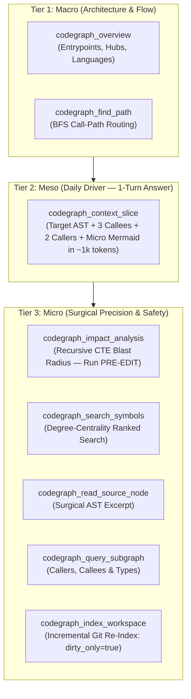

# CodeGraph — AI Agent Operational Playbook & System Instructions

> **Authoritative Guide for LLM Agents (Claude, GPT, Gemini) using the CodeGraph Model Context Protocol (MCP) Server.**  
> Maintained by **Ashvin K S**  
> Version: **0.3.0 ("The Colby Killer")**

---

## 1. Core Philosophy: Surgical AST Intelligence vs. Naive File Dumping

Most AI coding assistants suffer from **Context Window Pollution** and **Catastrophic Forgetting** because they ingest code naively:
1. They `cat` or read entire 500–2,000 line source files just to inspect a single 20-line helper function.
2. Tools like `@colbymchenry/codegraph` dump up to 12 entire raw source files (20,000–60,000 characters) into the context window in a single turn.
3. After 3 to 5 turns, the agent's context window is exhausted, latency degrades, and the model forgets earlier instructions.

**CodeGraph solves this fundamentally.**  
CodeGraph indexes code into a local SQLite database using **100% pure Tree-Sitter WebAssembly parsers** (zero regex, true compiler-grade boundaries). It allows agents to retrieve **exact AST-bounded function definitions**, traverse call graphs with **recursive CTEs in <6 ms**, and ingest surgical context clusters in **under 1,200 tokens**.

---

## 2. The 3-Tier Codebase Exploration Hierarchy

When investigating, explaining, or modifying a codebase, always follow the **3-Tier Exploration Pyramid**:



---

### Tier 1: Macro (Orientation & Call Flow)

#### `codegraph_overview`
- **When to use**: Call this **FIRST** whenever you open or enter an unfamiliar repository or workspace.
- **What it gives you**:
  - Detected top-level entrypoints (`main`, `activate`, `createApp`, `run`, `bootstrap`).
  - Degree-centrality architectural hubs (the functions and classes with the highest number of callers and callees).
  - Language composition and indexed file counts.
- **Example**:
  ```json
  { "top_n": 10 }
  ```

#### `codegraph_find_path`
- **When to use**: When you need to understand how execution flows from an entrypoint down to a deep subsystem (e.g. "How does a user click trigger the SQLite query?").
- **What it gives you**: The shortest BFS call-chain connecting `from_symbol` to `to_symbol`.
- **Example**:
  ```json
  { "from_symbol": "activate", "to_symbol": "createApp" }
  ```

---

### Tier 2: Meso (The Daily Driver Workhorse — 1-Turn Context Ingestion)

#### `codegraph_context_slice` ⭐ **[PRIMARY WORKHORSE TOOL]**
- **When to use**: **This is your primary workhorse tool.** Whenever asked:
  - *"How does function X work?"*
  - *"Where is method Y called and what does it do?"*
  - *"Explain the auth flow in X."*
- **What it returns in a SINGLE turn**:
  1. Exact AST-bounded source code of the target symbol.
  2. AST-bounded excerpts of its top 2–3 direct dependencies (callees).
  3. AST-bounded excerpts of its top 2–3 callers (just the caller functions, **NOT** the entire files!).
  4. Blast radius summary & test coverage detection.
  5. A micro Mermaid sequence/flow diagram.
- **Token Economics**: Consumes only **~800–1,200 tokens** (vs. 20,000+ tokens for raw file dumps), saving **95%+ of your context window** and eliminating 3–5 roundtrip tool calls.
- **Example**:
  ```json
  { "symbol": "createApp" }
  ```

---

### Tier 3: Micro (Surgical Surgery & Pre-Edit Safety Guardrails)

#### `codegraph_impact_analysis` ⚠️ **[MANDATORY PRE-EDIT TOOL]**
- **When to use**: **ALWAYS run this before editing, renaming, or refactoring any symbol.**
- **What it gives you**: Recursive CTE blast radius traversal showing all direct and indirect downstream callers and dependents up to $N$ hops away.
- **Why it matters**: Prevents you from breaking callers in other files or packages.
- **Example**:
  ```json
  { "symbol": "assertWorkspace", "max_depth": 3 }
  ```

#### `codegraph_search_symbols`
- **When to use**: When you know a partial name or concept but don't know the exact symbol name or file path.
- **What it gives you**: Substring search ranked by **network degree-centrality** (architectural hubs and core utilities appear before minor local variables).
- **Example**:
  ```json
  { "query": "Indexer", "kind": "class" }
  ```

#### `codegraph_read_source_node`
- **When to use**: When you only want to read the source code of a single symbol without its callers or callees.
- **What it gives you**: Exact AST-bounded source excerpt.
- **Example**:
  ```json
  { "symbol": "formatExplainResult" }
  ```

#### `codegraph_query_subgraph`
- **When to use**: When you need a relational inspection of incoming callers and outgoing calls.
- **Formats supported**: `"compact"`, `"mermaid"`, `"json"`.

#### `codegraph_index_workspace`
- **When to use**:
  - After making code edits: call with `dirty_only: true` to re-index changed files in <1 second via `git status --porcelain`.
  - When switching branches or after large pull requests: call with `force_reindex: false`.
- **Example**:
  ```json
  { "dirty_only": true }
  ```

---

## 3. Dynamic Multi-Workspace Routing

The CodeGraph MCP server features an **In-Memory Connection Pool**. You do not need to restart the server when switching projects or querying across repositories.

- **Option A: Explicit `workspace` Parameter**:
  Every CodeGraph tool accepts an optional `workspace` parameter:
  ```json
  {
    "symbol": "App",
    "workspace": "C:/Developer/Code/OneResi"
  }
  ```
- **Option B: Automatic Upward Discovery**:
  If you pass a file path in `file`, CodeGraph automatically walks up the filesystem hierarchy to discover the nearest `.codegraph/` or `.git/` repository root and pools the connection in memory.

---

## 4. Strict AI Directives & Anti-Patterns

To maintain peak reasoning capability, you must obey these 4 rules:

| ❌ NEVER DO THIS | ✅ ALWAYS DO THIS INSTEAD |
| :--- | :--- |
| **Never dump entire 500+ line files** using `cat` or whole-file readers when investigating logic flow. | Call **`codegraph_context_slice(symbol="name")`** to get the target AST and its neighbors in ~1,000 tokens. |
| **Never make 3–5 sequential tool turns** (search -> read file -> grep for callers -> read callers). | Call **`codegraph_context_slice`** to receive the entire cluster in **1 single turn**. |
| **Never edit or refactor code blindly** without knowing downstream impact. | Run **`codegraph_impact_analysis`** first to check the complete blast radius. |
| **Never re-index the whole repository** after making a simple 1-line edit. | Run **`codegraph_index_workspace(dirty_only=true)`** for sub-second incremental syncing. |

---

## 5. Ready-to-Use Agent System Prompt Snippet

Add this snippet to your agent's system prompt, `CLAUDE.md`, `.cursorrules`, `.windsurfrules`, or `.clinerules`:

```markdown
## Structural Code Intelligence via CodeGraph MCP

You are equipped with CodeGraph, an AST-level relational intelligence engine powered by Tree-Sitter WebAssembly and SQLite recursive CTEs.

Follow this 3-tier workflow:
1. Macro Architecture: Use `codegraph_overview` on new repositories to discover entrypoints and architectural hubs.
2. Daily Workhorse: Use `codegraph_context_slice(symbol="name")` as your DEFAULT tool for understanding any function, class, or method. It returns target AST + top callers + top callees + blast radius in 1 turn (~1,000 tokens). NEVER read entire 500+ line files when investigating logic.
3. Pre-Edit Safety: ALWAYS run `codegraph_impact_analysis(symbol="name")` before modifying or refactoring code to inspect downstream dependents.
4. Keep Index Fresh: Run `codegraph_index_workspace(dirty_only=true)` after applying file edits to refresh the index in <1s.
5. Multi-Repo: Pass `workspace: "/path/to/repo"` to query external workspaces on the fly.
```
