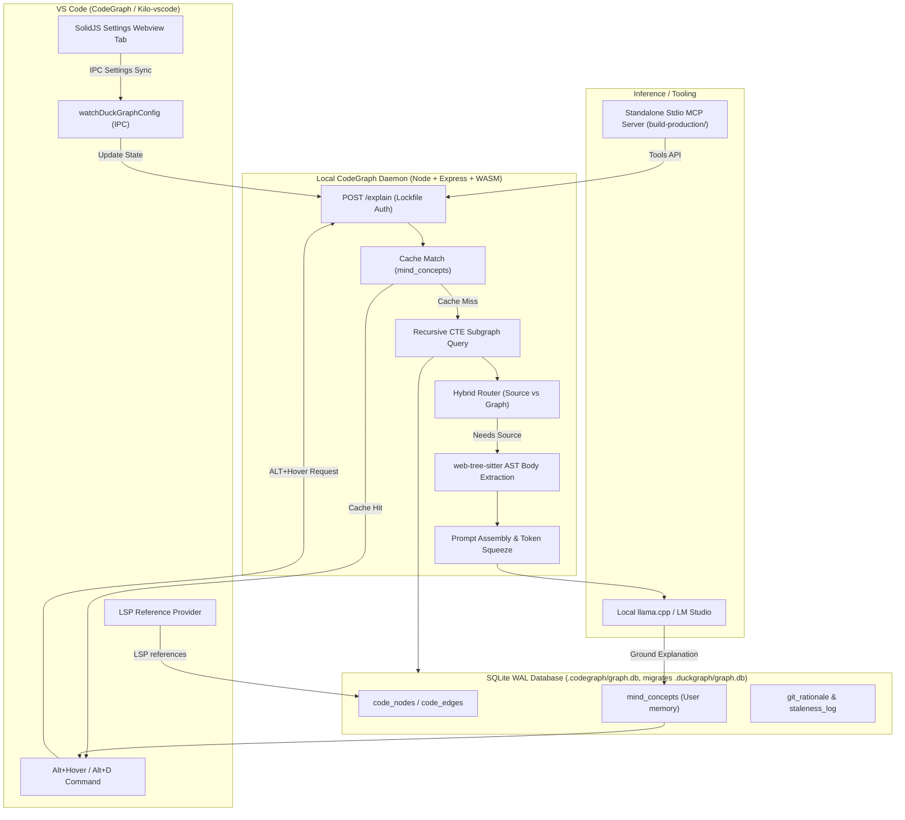

# CodeGraph

> Local-first codebase graph, bounded AST explanations, and grounded cognitive memory.
> Formerly DuckGraph — all `duckgraph.*` commands, settings, storage, env vars, and MCP tools still work as aliases.

Maintained by **Ashvin K S**.

CodeGraph is a VS Code coding environment built on Kilo Code and OpenCode that adds local-first structural code intelligence, interactive hovers, and a persistent graph cache.

It explains symbols from your codebase using a local graph, optional local LLM completions, and a Git-aware staleness tracker. Everything runs offline — no cloud services and no telemetry.

---

## What lives where (independent vs intertwined)

| Path | Ships how | Depends on |
|---|---|---|
| `build-production/` | Copy this folder alone to friends / Claude Desktop | Nothing else in the repo. Only `better-sqlite3` + MCP SDK. No VS Code, no daemon, no `kilocode/`. |
| `*.vsix` (extension) | `npm run package` → `kilocode-x.codegraph-0.2.0.vsix` | At *build time* needs `kilocode/` (thin `src/server/*` re-exports bundle it via esbuild). The `.vsix` itself is self-contained. |
| `src/` | Standalone extension source | `../../kilocode/packages/duckgraph` at build time (documented SSOT). Runtime is bundled. |
| `kilocode/` | Nested Kilo Code checkout (separate `.git`) | Upstream monorepo; canonical engine lives at `kilocode/packages/duckgraph/src`. |
| `mcp/duckgraph-mcp/` | Daemon-backed MCP wrapper (needs the extension running) | Running daemon + lockfile. Prefer `build-production/` for Claude Desktop. |

---

## Installation & Setup

### 1. VS Code Extension

#### From GitHub Releases (Recommended)
Download [`codegraph-0.3.0.vsix`](https://github.com/Ashvin-KS/codegraph/releases/tag/v0.3.0) from the [v0.3.0 Release](https://github.com/Ashvin-KS/codegraph/releases/tag/v0.3.0).

Install via CLI:
```powershell
code --install-extension codegraph-0.3.0.vsix
```
Or via VS Code UI:
1. Open VS Code → Extensions (`Ctrl+Shift+X` / `Cmd+Shift+X`).
2. Click **`...`** (Views and More Actions) in the top-right corner.
3. Select **Install from VSIX...** and select `codegraph-0.3.0.vsix`.

#### Or Build from Source
```powershell
npm install
npm run build
npm run package
code --install-extension codegraph-0.3.0.vsix
```

---

### 2. Standalone MCP Server (Any AI Client)

The `build-production/` folder is **100% independent** (requires only Node.js 20+ and SQLite). It has **zero runtime dependencies** on VS Code, the KiloCode monorepo, or local daemons.

#### Step 1: Install Globally
```powershell
# From the repository root or build-production:
npm install -g ./build-production

# Or directly from the release bundle:
npm install -g ./release/mcp
```
*This places `codegraph-mcp` and `codegraph-setup` on your system `PATH`.*

#### Step 2: Choose Execution Mode

- **Mode A: Dynamic Multi-Workspace Pool (Recommended)**:
  Run `codegraph-mcp` with **no arguments**. CodeGraph will automatically auto-discover the project root (finding the nearest `.codegraph/` or `.git/` folder) based on whichever file or folder is queried, and keep active workspaces pooled in memory.
- **Mode B: Fixed Workspace**:
  Pass `--workspace <path>` to pin the MCP server to a specific project.

---

### 3. MCP Client Configuration Guides

#### Claude Desktop (`claude_desktop_config.json`)
Location:
- **Windows**: `%APPDATA%\Claude\claude_desktop_config.json`
- **macOS**: `~/Library/Application Support/Claude/claude_desktop_config.json`
- **Linux**: `~/.config/Claude/claude_desktop_config.json`

**Automated Setup:**
```powershell
node ./build-production/bin/codegraph-setup.js --workspace C:/path/to/your-project
```

**Manual JSON Config:**
```json
{
  "mcpServers": {
    "codegraph": {
      "command": "codegraph-mcp"
    }
  }
}
```
*(If `codegraph-mcp` is not installed globally, replace `"command": "codegraph-mcp"` with `"command": "node"` and `"args": ["C:/path/to/build-production/bin/codegraph-mcp.js"]`)*.

#### Claude Code CLI
```powershell
claude mcp add codegraph -- codegraph-mcp
```

#### Cursor IDE (`.cursor/mcp.json`)
Create or edit `.cursor/mcp.json` in your project root or configure in **Cursor Settings → Features → MCP**:
```json
{
  "mcpServers": {
    "codegraph": {
      "command": "codegraph-mcp"
    }
  }
}
```

#### Windsurf IDE (`mcp_config.json`)
Add to `~/.codeium/windsurf/mcp_config.json`:
```json
{
  "mcpServers": {
    "codegraph": {
      "command": "codegraph-mcp"
    }
  }
}
```

#### Google Antigravity / Gemini CLI
Add to your project's `mcp_config.json` or `~/.gemini/antigravity/mcp/`:
```json
{
  "mcpServers": {
    "codegraph": {
      "command": "codegraph-mcp"
    }
  }
}
```

#### Cline & Roo-Code (`mcpSettings.json`)
Add to your global or workspace `mcpSettings.json`:
```json
{
  "mcpServers": {
    "codegraph": {
      "command": "codegraph-mcp",
      "disabled": false,
      "autoApprove": [
        "codegraph_overview",
        "codegraph_search_symbols",
        "codegraph_context_slice",
        "codegraph_explain_symbol",
        "codegraph_impact_analysis",
        "codegraph_find_path",
        "codegraph_read_source_node",
        "codegraph_health"
      ]
    }
  }
}
```

#### Zed Editor (`settings.json`)
Add under `context_servers` in Zed's `settings.json`:
```json
{
  "context_servers": {
    "codegraph": {
      "command": "codegraph-mcp"
    }
  }
}
```

---

### 4. One-Command Automated Installer (`release/`)

From the `release/` folder or downloaded release bundle:

**Windows PowerShell:**
```powershell
.\install.ps1 -Workspace C:\path\to\your-project
```

**macOS / Linux:**
```bash
./install.sh --workspace /path/to/your-project
```
This installs the global MCP server, writes the Claude Desktop configuration, and installs the `.vsix` in one step. Pass `-SkipMcp` or `-SkipExtension` to selectively install components.

---

### 5. Developer / Build Verification

```powershell
npm run lint              # ESLint check
npm run typecheck         # TypeScript check
npm test                  # Vitest regression test suite (13/13 passing)
npm run build:production  # Standalone MCP stdio smoke test
npm run release           # Assembles release/ distribution bundle
```

---

## Architecture



---

## Key features in 0.3.0

- **100% Pure Tree-Sitter WASM Engine**: Complete eradication of regex fallback parsing across both daemon and standalone MCP. True compiler-grade AST parsing with zero native C++ compiler toolchains required.
- **1-Turn Composite Tool (`codegraph_context_slice`)**: Delivers single-turn answer speed without context pollution. Returns target symbol AST + top callers' ASTs + top callees' ASTs + blast radius + micro Mermaid diagram in ~800–1,200 tokens.
- **Dynamic Multi-Workspace Auto-Discovery & Connection Pool**: Standalone MCP can query any folder or file without restarting. Automatically walks up the directory tree to find `.codegraph/` or `.git/` and pools open databases in memory.
- **Degree-Centrality Ranked Search**: Symbol searches are weighted by network degree so architectural hubs surface before minor variables.
- **Stable re-index**: node keys are `file + kind + name` (never line numbers). Line shifts update silently without a new tree, without touching `updated_at`, without spurious `STALE`. Duplicate symbols get deterministic `#2` suffixes. Empty parses no longer wipe the graph. `orbit` ordering is stable (`file, name`).
- **Branch-safe**: git watcher resolves worktree `.git` files, diffs `HEAD@{1}..HEAD` with merge-aware fallback, and stale line numbers are clamped instead of `400`. Files escaping the workspace are rejected.
- **MCP that works**: lockfile discovery checks `--workspace` / `CODEGRAPH_WORKSPACE`, workspace `.codegraph/` + `.duckgraph/`, and all publisher `globalStorage` roots; 30s timeouts with actionable errors; `integer` schemas with descriptions; `codegraph_health` tool; `explain` returns `summary` + `usage_guidance` so Claude needs no llama.cpp.
- **Rename without breakage**: extension id `kilocode-x.codegraph`, commands/settings/storage/env/MCP tools all dual-named (`codegraph.*` primary, `duckgraph.*` alias). DB auto-migrates `.duckgraph/graph.db` → `.codegraph/graph.db` by copy.

---

## Repository layout

- `src/` — standalone extension source, now **vendored and self-contained** (was thin re-exports; vendored in 0.2.0 so the extension builds, lints, and tests with no `kilocode/` checkout). Canonical upstream mirror lives at `kilocode/packages/duckgraph/src` (nested repo, kept in sync).
- `kilocode/` — nested Kilo Code checkout (separate git repo).
  - `packages/duckgraph/` — upstream mirror of the engine (WASM parsers, Express daemon, database).
  - `packages/kilo-vscode/` — VS Code extension, settings tab, config watchers.
  - `packages/opencode/` — agent prompt mappings and tool registrations.
- `mcp/duckgraph-mcp/` — daemon-backed stdio MCP wrapper (needs the extension running).
- `build-production/` — **independent** standalone MCP server (pure Tree-Sitter WASM, no daemon, no VS Code, no `kilocode/`).

---

## Configuration

New `codegraph.*` settings (legacy `duckgraph.*` still read as fallback):

| Property | Default | Description |
|---|---|---|
| `codegraph.llamaUrl` | `"http://localhost:8080/completion"` | Local llama.cpp endpoint for hover completions. |
| `codegraph.userLevel` | `"intermediate"` | Explanation depth (`beginner`, `intermediate`, `expert`). |
| `codegraph.enabledLanguages` | `["rust","typescript","typescriptreact","python"]` | Indexer filter (all 21 parser languages supported when enabled). |
| `codegraph.hoverMode` | `"always"` | `always` or `commandOnly`. |
| `codegraph.indexOnStartup` | `true` | Index on activation. |
| `codegraph.maxEdges` | `15` | Circuit breaker for highly referenced nodes. |
| `codegraph.debugGraphJson` | `false` | Append graph JSON to hovers. |

Env: `CODEGRAPH_WORKSPACE`, `CODEGRAPH_LOCKFILE`, `CODEGRAPH_DB`, `CODEGRAPH_GLOBAL_STORAGE`, `CODEGRAPH_NODE_PATH` (each with `DUCKGRAPH_*` fallback). Auth headers: `X-CodeGraph-Auth` (server also accepts `X-DuckGraph-Auth`).

---

## Agent Playbook: The 3-Tier Execution Order

> 📖 **Full Specification**: See [AI_INSTRUCTIONS.md](file:///c:/Developer/Code/vscodeextension/AI_INSTRUCTIONS.md) for the complete LLM system prompt, cross-repository routing guide, and token economics benchmarks.

AI agents (Claude, GPT-4o, Gemini 2.0 Pro) should organize exploration into three tiers:

### Tier 1: Macro (Architecture & Map)
- **`codegraph_overview`**: Call this FIRST in unfamiliar workspaces. Returns entrypoints (`main`, `activate`, `createApp`, `run`), degree-centrality hubs, and language statistics.
- **`codegraph_find_path`**: Trace execution flow between any two symbols (`from_symbol` -> `to_symbol`) using BFS call-chain routing.

### Tier 2: Meso (Daily Driver — 1-Turn Context Ingestion)
- **`codegraph_context_slice`** ⭐ **[PRIMARY WORKHORSE TOOL]**: The default tool for answering coding questions in **1 single turn**. Returns:
  1. Target function's exact AST-bounded source code.
  2. Top 2–3 callers and callees (just the functions, **NOT** entire files!).
  3. Blast radius summary & test coverage detection.
  4. Micro Mermaid diagram.
  Total payload: **~800–1,200 tokens** (vs. Colby McHenry's 10,000–30,000 tokens for whole files), saving **95%+ of your context window** and eliminating 3–5 sequential tool turns.

### Tier 3: Micro (Surgical Precision & Pre-Edit Safety)
- **`codegraph_impact_analysis`** ⚠️ **[MANDATORY PRE-EDIT TOOL]**: Blast radius recursive CTE tracing all downstream dependents up to $N$ hops away. **ALWAYS run this BEFORE editing, renaming, or refactoring a symbol.**
- **`codegraph_search_symbols`**: Fast degree-centrality ranked search across the workspace. Architectural hubs surface before minor variables.
- **`codegraph_read_source_node`**: Extract AST-bounded code window for a symbol without reading surrounding lines.
- **`codegraph_query_subgraph`**: Relationship subgraph showing callers, callees, and type dependencies (`compact`, `mermaid`, or `json`).
- **`codegraph_index_workspace`**: Incremental Git-aware re-indexer. Run with `dirty_only: true` after code edits to refresh the index in <1 second.
- **`codegraph_confirm_edge`** / **`codegraph_dismiss_edge`**: Curate inferred edges.

### Strict Agent Directives:
- ❌ **Never dump whole 500+ line files** with file readers or `cat` when investigating function logic; use `codegraph_context_slice`.
- ❌ **Never make 3–5 sequential tool turns** guessing callers and callees; `codegraph_context_slice` delivers the entire cluster in 1 turn.
- ❌ **Never edit or refactor code** without running `codegraph_impact_analysis` first.
- ❌ **Never re-index the whole repository** after a minor edit; use `codegraph_index_workspace(dirty_only=true)`.
- 🌐 **Multi-Repo Routing**: Pass `workspace: "/path/to/repo"` to any tool to query external projects without restarting the server.

---

## MCP Tools Reference (12 Tools)

Primary tools (`codegraph_*`; legacy `duckgraph_*` aliases supported):

1. **`codegraph_overview`** — High-level architectural map with entrypoints, centrality hubs, and language distribution.
2. **`codegraph_search_symbols`** — Degree-centrality ranked search across all indexed symbols with kinds, files, and lines.
3. **`codegraph_context_slice`** — [NEW] 1-Turn composite context slice (target + callers + callees + blast radius in ~1,000 tokens).
4. **`codegraph_explain_symbol`** — Grounded symbol explanation with callers/callees and bounded source excerpt (`compact`, `mermaid`, or `json`).
5. **`codegraph_query_subgraph`** — Bounded relationship graph for a symbol.
6. **`codegraph_impact_analysis`** — Blast radius analysis showing all downstream dependents/callers up to $N$ hops away.
7. **`codegraph_find_path`** — Shortest call chain between two symbols.
8. **`codegraph_read_source_node`** — AST-bounded source excerpt for a symbol.
9. **`codegraph_index_workspace`** — Index or re-index the workspace with pure Tree-Sitter WASM (`dirty_only: true` for fast git updates).
10. **`codegraph_health`** — Index stats, db path, and active pooled workspaces.
11. **`codegraph_confirm_edge`** — Confirm an inferred edge.
12. **`codegraph_dismiss_edge`** — Reject an inferred edge.

---

## Credits

- Author/maintainer: **Ashvin K S**
- Built on Kilo Code and OpenCode. Uses the VS Code Extension API, the Model Context Protocol SDK, tree-sitter, web-tree-sitter, tree-sitter-wasms, SQLite (`better-sqlite3`), Express, and D3.
