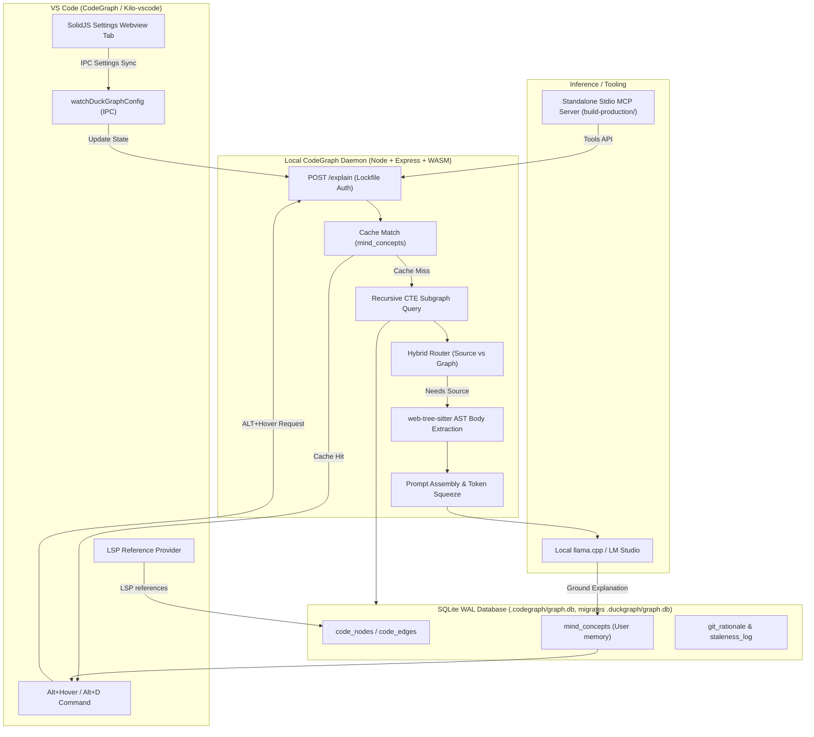

# CodeGraph

> Local-first codebase graph, bounded AST explanations, and grounded cognitive memory.
> Formerly DuckGraph — all `duckgraph.*` commands, settings, storage, env vars, and MCP tools still work as aliases.

Maintained by **Ashvin K S**.

CodeGraph is a VS Code coding environment built on Kilo Code and OpenCode that adds local-first structural code intelligence, interactive hovers, and a persistent graph cache.

It explains symbols from your codebase using a local graph, optional local LLM completions, and a Git-aware staleness tracker. Everything runs offline — no cloud services and no telemetry.

---

## What lives where (independent vs intertwined)

| Path | Ships how | Depends on |
|---|---|---|
| `build-production/` | Copy this folder alone to friends / Claude Desktop | Nothing else in the repo. Only `better-sqlite3` + MCP SDK. No VS Code, no daemon, no `kilocode/`. |
| `*.vsix` (extension) | `npm run package` → `kilocode-x.codegraph-0.2.0.vsix` | At *build time* needs `kilocode/` (thin `src/server/*` re-exports bundle it via esbuild). The `.vsix` itself is self-contained. |
| `src/` | Standalone extension source | `../../kilocode/packages/duckgraph` at build time (documented SSOT). Runtime is bundled. |
| `kilocode/` | Nested Kilo Code checkout (separate `.git`) | Upstream monorepo; canonical engine lives at `kilocode/packages/duckgraph/src`. |
| `mcp/duckgraph-mcp/` | Daemon-backed MCP wrapper (needs the extension running) | Running daemon + lockfile. Prefer `build-production/` for Claude Desktop. |

---

## Quick start

### A. Standalone MCP for Claude Desktop (recommended, no VS Code)

```powershell
npm install -g ./build-production
codegraph-setup --workspace C:/path/to/your-project
# restart Claude Desktop — done
```

This writes the global `codegraph-mcp` entry into `claude_desktop_config.json`
for you (see `build-production/examples/claude_desktop_config.json`).
Then in Claude: `codegraph_health` → `codegraph_index_workspace` → `codegraph_explain_symbol`.

### B. VS Code extension (`kilocode-x.codegraph`)

```powershell
npm install
npm run build
npm run lint
npm run typecheck
npm test
npm run package
code --install-extension kilocode-x.codegraph-0.2.0.vsix
```

### C. Validate the shippable MCP

```powershell
# from the repo root (needs build-production/node_modules for the smoke test)
cd build-production; npm install; cd ..
npm run build:production
```

### D. GitHub release folder

```powershell
npm run release   # assembles release/ : installer + mcp/ + vsix + docs, nothing else
```

`release/` is the minimal post-to-GitHub set: `install.ps1` / `install.sh`,
`mcp/` (standalone server), `codegraph-*.vsix`, `README.md`, `LICENSE.txt`,
`CHANGELOG.md`. Regenerate it after any vsix or MCP change.

---

## Architecture



---

## Key fixes in 0.2.0

- **Stable re-index**: node keys are `file + kind + name` (never line numbers). Line shifts update silently without a new tree, without touching `updated_at`, without spurious `STALE`. Duplicate symbols get deterministic `#2` suffixes. Empty parses no longer wipe the graph. `orbit` ordering is stable (`file, name`).
- **Branch-safe**: git watcher resolves worktree `.git` files, diffs `HEAD@{1}..HEAD` with merge-aware fallback, and stale line numbers are clamped instead of `400`. Files escaping the workspace are rejected.
- **MCP that works**: lockfile discovery checks `--workspace` / `CODEGRAPH_WORKSPACE`, workspace `.codegraph/` + `.duckgraph/`, and all publisher `globalStorage` roots; 30s timeouts with actionable errors; `integer` schemas with descriptions; `codegraph_health` tool; `explain` returns `summary` + `usage_guidance` so Claude needs no llama.cpp.
- **Rename without breakage**: extension id `kilocode-x.codegraph`, commands/settings/storage/env/MCP tools all dual-named (`codegraph.*` primary, `duckgraph.*` alias). DB auto-migrates `.duckgraph/graph.db` → `.codegraph/graph.db` by copy.

---

## Repository layout

- `src/` — standalone extension source, now **vendored and self-contained** (was thin re-exports; vendored in 0.2.0 so the extension builds, lints, and tests with no `kilocode/` checkout). Canonical upstream mirror lives at `kilocode/packages/duckgraph/src` (nested repo, kept in sync).
- `kilocode/` — nested Kilo Code checkout (separate git repo).
  - `packages/duckgraph/` — upstream mirror of the engine (WASM parsers, Express daemon, database).
  - `packages/kilo-vscode/` — VS Code extension, settings tab, config watchers.
  - `packages/opencode/` — agent prompt mappings and tool registrations.
- `mcp/duckgraph-mcp/` — daemon-backed stdio MCP wrapper (needs the extension running).
- `build-production/` — **independent** standalone MCP server (no daemon, no VS Code, no `kilocode/`).

---

## Configuration

New `codegraph.*` settings (legacy `duckgraph.*` still read as fallback):

| Property | Default | Description |
|---|---|---|
| `codegraph.llamaUrl` | `"http://localhost:8080/completion"` | Local llama.cpp endpoint for hover completions. |
| `codegraph.userLevel` | `"intermediate"` | Explanation depth (`beginner`, `intermediate`, `expert`). |
| `codegraph.enabledLanguages` | `["rust","typescript","typescriptreact","python"]` | Indexer filter (all 21 parser languages supported when enabled). |
| `codegraph.hoverMode` | `"always"` | `always` or `commandOnly`. |
| `codegraph.indexOnStartup` | `true` | Index on activation. |
| `codegraph.maxEdges` | `15` | Circuit breaker for highly referenced nodes. |
| `codegraph.debugGraphJson` | `false` | Append graph JSON to hovers. |

Env: `CODEGRAPH_WORKSPACE`, `CODEGRAPH_LOCKFILE`, `CODEGRAPH_DB`, `CODEGRAPH_GLOBAL_STORAGE`, `CODEGRAPH_NODE_PATH` (each with `DUCKGRAPH_*` fallback). Auth headers: `X-CodeGraph-Auth` (server also accepts `X-DuckGraph-Auth`).

---

## MCP tools

Primary (`codegraph_*`; `duckgraph_*` aliases for the first six):

1. `codegraph_index_workspace` — index or force a full re-index.
2. `codegraph_query_subgraph` — bounded relationship graph for a symbol.
3. `codegraph_read_source_node` — AST-bounded source block for a symbol.
4. `codegraph_explain_symbol` — graph facts + bounded source + `summary` + `usage_guidance`.
5. `codegraph_confirm_edge` — confirm an inferred edge.
6. `codegraph_dismiss_edge` — reject an inferred edge.
7. `codegraph_health` — daemon/index stats.

---

## Credits

- Author/maintainer: **Ashvin K S**
- Built on Kilo Code and OpenCode. Uses the VS Code Extension API, the Model Context Protocol SDK, tree-sitter, web-tree-sitter, tree-sitter-wasms, SQLite (`better-sqlite3`), Express, and D3.
