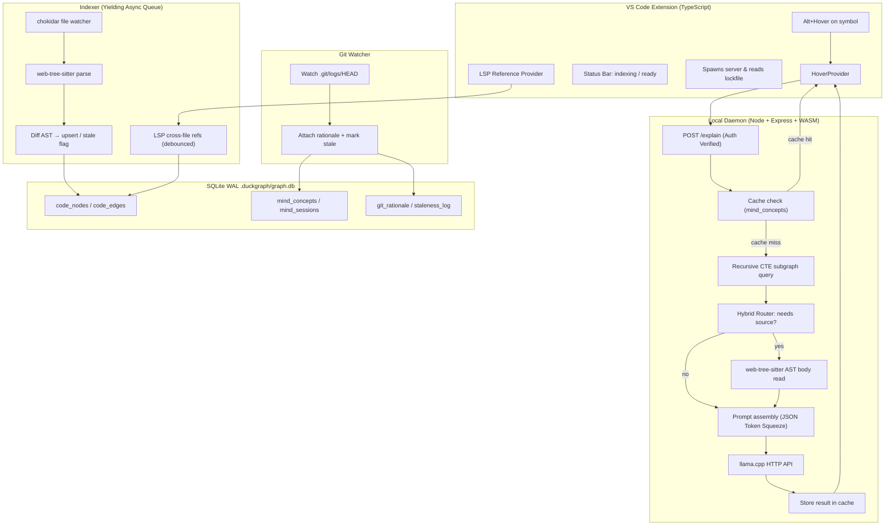
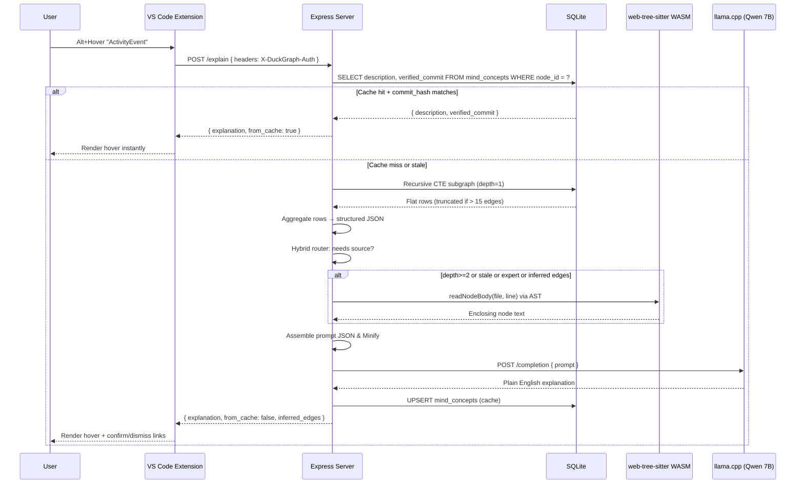

---

> 2026-05-22 implementation note: this document is the original standalone DuckGraph concept. The active product direction is now **Kairos + DuckGraph**: a Kilo Code/OpenCode-compatible agentic coding fork with DuckGraph hovers, chat context, Orbit graph, and reusable MCP tools. The hover-only/no-sidebar statements below are historical v1 constraints, not the current integrated product boundary.

## title: DuckGraph — LLM Wiki + Hover Memory  
version: v1.1

# DuckGraph: LLM Wiki + Hover Memory

**Final Specification v1.1 (Staff-Engineer Edition)**

**One sentence:** A VS Code extension that Alt+Hover explains your own code back to you in plain English, remembers your decisions, and never hallucinates links because every explanation is grounded in a local, verified, and secure graph of your codebase.

---

## 1. Executive Summary

DuckGraph is a local-first codebase intelligence layer for VS Code. It maintains two persistent graphs inside a SQLite database:

1. **The Code Graph:** every function, struct, trait, module, and their verified relationships (`calls`, `uses_type`, `mutates`, `implements`, `imports`, `re_exports`). Built by tree-sitter AST parsing plus cross-file LSP reference queries.
    
2. **The Mind Graph:** your personal cognitive model — what you understand, what confuses you, your past decisions, cached explanations, and per-node user level. Versioned by git commit hash so it invalidates automatically when code changes.
    

When you Alt+Hover any symbol, DuckGraph extracts a bounded subgraph, optionally reads the raw AST node body, feeds a structured JSON prompt to a local LLM, and returns a 1–2 sentence explanation in a native VS Code hover popover. No chat. No sidebar. No cloud.

---

## 2. What It Is Not

- Not a chatbot
    
- Not a Copilot clone
    
- Not a Zed fork
    
- Not a cloud service
    
- Not RAG chunking over files
    
- Not a sidebar or panel in v1
    

---

## 3. Conceptual Split

|Layer|Audience|What It Is|Never Contains|
|---|---|---|---|
|**LLM Wiki**|Machine (LLM)|Subgraph JSON, verified edges, git rationale, mind graph concepts|Raw file dumps, unverified structural claims|
|**Hover Memory**|Human|1–2 sentence plain English, why it exists, stale flags, inferred edge confirmations|Graph topology, SQL, LLM internals|

---

## 4. Key Invariant

```typescript
/**
 * INVARIANT: Graph is ground truth for RELATIONSHIPS.
 *            Source is ground truth for IMPLEMENTATION.
 *
 * The LLM may NEVER assert a calls/depends_on/used_by relationship
 * unless that edge exists in code_edges with confidence='syntactic'.
 *
 * Inferred edges are displayed as uncertain and require user confirmation
 * before being treated as structural fact.
 *
 * Violating this invariant is how every other tool hallucinates architecture.
 */
```

---

## 5. System Architecture



---

## 6. Data Flow Diagrams

### 6.1 Hover Request Flow



---

## 7. SQLite Schema

```sql
-- ============================================================
-- CODE GRAPH
-- ============================================================
CREATE TABLE IF NOT EXISTS code_nodes (
    id           INTEGER PRIMARY KEY,
    name         TEXT    NOT NULL,
    kind         TEXT    NOT NULL,
    file         TEXT    NOT NULL,
    line_start   INTEGER,
    line_end     INTEGER,
    signature    TEXT,
    body_hash    TEXT,
    commit_hash  TEXT    DEFAULT 'unknown',
    indexed_at   TIMESTAMP DEFAULT CURRENT_TIMESTAMP
);

CREATE INDEX IF NOT EXISTS idx_nodes_name_file ON code_nodes(name, file);
CREATE INDEX IF NOT EXISTS idx_nodes_file_line ON code_nodes(file, line_start);

CREATE TABLE IF NOT EXISTS code_edges (
    id              INTEGER PRIMARY KEY,
    from_id         INTEGER NOT NULL,
    to_id           INTEGER NOT NULL,
    type            TEXT    NOT NULL,
    confidence      TEXT    DEFAULT 'syntactic',
    inferred_score  REAL,
    confirmed_at    TIMESTAMP,
    dismissed       BOOLEAN DEFAULT 0,
    file_context    TEXT,
    UNIQUE(from_id, to_id, type),
    FOREIGN KEY (from_id) REFERENCES code_nodes(id) ON DELETE CASCADE,
    FOREIGN KEY (to_id)   REFERENCES code_nodes(id) ON DELETE CASCADE
);

CREATE INDEX IF NOT EXISTS idx_edges_from ON code_edges(from_id);
CREATE INDEX IF NOT EXISTS idx_edges_to   ON code_edges(to_id);

-- ============================================================
-- MIND GRAPH
-- ============================================================
CREATE TABLE IF NOT EXISTS mind_concepts (
    id               INTEGER PRIMARY KEY,
    node_id          INTEGER,
    term             TEXT    NOT NULL,
    description      TEXT,
    user_level       TEXT    DEFAULT 'intermediate',
    verified_commit  TEXT,
    context_used     TEXT,
    created_at       TIMESTAMP DEFAULT CURRENT_TIMESTAMP,
    UNIQUE(node_id),
    FOREIGN KEY (node_id) REFERENCES code_nodes(id) ON DELETE CASCADE
);

CREATE TABLE IF NOT EXISTS mind_sessions (
    id              INTEGER PRIMARY KEY,
    timestamp       TIMESTAMP DEFAULT CURRENT_TIMESTAMP,
    trigger_symbol  TEXT,
    zoom_level      TEXT,
    was_confused    BOOLEAN DEFAULT 0,
    explanation     TEXT
);

CREATE TABLE IF NOT EXISTS mind_concept_sessions (
    concept_id  INTEGER NOT NULL,
    session_id  INTEGER NOT NULL,
    FOREIGN KEY (concept_id) REFERENCES mind_concepts(id) ON DELETE CASCADE,
    FOREIGN KEY (session_id) REFERENCES mind_sessions(id) ON DELETE CASCADE
);

-- ============================================================
-- RATIONALE LAYER
-- ============================================================
CREATE TABLE IF NOT EXISTS git_rationale (
    id             INTEGER PRIMARY KEY,
    node_id        INTEGER NOT NULL,
    commit_hash    TEXT    NOT NULL,
    commit_message TEXT,
    pr_number      TEXT,
    author         TEXT,
    committed_at   TIMESTAMP,
    FOREIGN KEY (node_id) REFERENCES code_nodes(id) ON DELETE CASCADE
);

-- ============================================================
-- STALENESS TRACKING
-- ============================================================
CREATE TABLE IF NOT EXISTS staleness_log (
    id              INTEGER PRIMARY KEY,
    node_id         INTEGER NOT NULL,
    old_commit      TEXT,
    new_commit      TEXT,
    reason          TEXT,
    detected_at     TIMESTAMP DEFAULT CURRENT_TIMESTAMP,
    re_verified_at  TIMESTAMP,
    FOREIGN KEY (node_id) REFERENCES code_nodes(id) ON DELETE CASCADE
);
```

---

## 8. Graph Traversal & "God Node" Circuit Breaker

Recursive CTE — core query. Never reads files. Includes circuit breaker for highly referenced utilities to prevent context window overflow.

```sql
WITH RECURSIVE subgraph(node_id, depth, path) AS (
    SELECT id, 0, json_array(id)
    FROM code_nodes
    WHERE name = :symbol
      AND file = :file

    UNION ALL

    SELECT e.to_id,
           s.depth + 1,
           json_insert(s.path, '$[#]', e.to_id)
    FROM code_edges e
    JOIN subgraph s ON e.from_id = s.node_id
    WHERE s.depth < :depth
      AND e.confidence = 'syntactic'
      AND e.dismissed  = 0
      AND e.type IN ('calls', 'uses_type', 'mutates', 'implements', 'used_by')
      -- CIRCUIT BREAKER: Stop expanding if node has > 15 incoming edges
      AND (SELECT COUNT(*) FROM code_edges WHERE to_id = e.to_id) <= 15
)
SELECT
    n.*,
    e.type            AS edge_type,
    e.confidence,
    e.inferred_score,
    r.commit_message  AS why_it_exists,
    mc.description    AS my_cached_explanation,
    mc.user_level     AS my_level,
    sl.reason         AS stale_reason,
    sl.detected_at    AS stale_since,
    CASE
        WHEN n.commit_hash = 'unknown' THEN 'UNINDEXED'
        WHEN mc.verified_commit IS NULL THEN 'NEW'
        WHEN mc.verified_commit != n.commit_hash THEN 'STALE'
        ELSE 'FRESH'
    END               AS freshness,
    tn.name           AS target_name
FROM subgraph s
JOIN code_nodes n    ON s.node_id = n.id
LEFT JOIN code_edges e      ON e.from_id = s.node_id
LEFT JOIN code_nodes tn     ON e.to_id = tn.id
LEFT JOIN git_rationale r   ON r.node_id = n.id AND r.commit_hash = n.commit_hash
LEFT JOIN mind_concepts mc  ON mc.node_id = n.id
LEFT JOIN staleness_log sl  ON sl.node_id = n.id AND sl.re_verified_at IS NULL
ORDER BY s.depth, n.name;
```

---

## 9. Hybrid Retrieval Router

```typescript
interface RetrievalContext {
  subgraph: SubgraphResult;
  source: SourceSnippet | null;
}

async function assembleContext(
  symbol: string,
  file: string,
  line: number,
  depth: number,
  userLevel: string
): Promise<RetrievalContext> {
  // Always get graph first
  const subgraph = await querySubgraph(symbol, file, depth);

  // Router Boolean Logic: Do we need raw source?
  const hasInferredEdges = subgraph.edges.some(e => e.confidence === 'inferred');
  const isStale = subgraph.freshness === 'STALE';
  const isExpert = userLevel === 'expert';
  const needsBody = depth >= 2;

  const needsSource = hasInferredEdges || isStale || isExpert || needsBody;

  let source: SourceSnippet | null = null;

  if (needsSource) {
    // AST-bounded extraction — never slice by line ± N.
    // Always use the enclosing AST node boundary.
    source = await readNodeBody(file, line);
  }

  return { subgraph, source };
}
```

---

## 10. LLM Prompt Template & Context Squeezing

The LLM never sees a raw file dump. It sees a structured JSON object. **Context Squeezing Policy:** Before sending, the backend strips all nulls, empty arrays, and whitespace from this JSON.

```json
{
  "system": "You are a codebase explainer. You receive a verified subgraph of code relationships and optionally raw source. Use the graph for ALL structural claims (what calls what, what depends on what). Use source ONLY for implementation detail or inline comments. Never state a relationship not present in the graph edges.",
  "user_level": "intermediate",
  "subgraph": {
    "target": {
      "name": "ActivityEvent",
      "kind": "struct",
      "signature": "pub struct ActivityEvent { window_title_hash: u64, ... }"
    },
    "edges": [
      { "type": "calls", "target": "XxHash64::hash", "confidence": "syntactic" },
      { "type": "used_by", "target": "intent_tracker.rs", "confidence": "syntactic" },
      { "type": "gates", "target": "DB writer", "confidence": "inferred", "score": 0.82 }
    ],
    "rationale": {
      "introduced": "PR #31 — activity tracking v1",
      "last_changed": "commit a1b2c — added window_title_hash for perf"
    },
    "mind_graph": {
      "user_level": "intermediate",
      "past_decisions": ["chose XxHash64 over MD5 — speed, session_12"],
      "freshness": "FRESH"
    }
  },
  "source": null,
  "instructions": "Explain in exactly 2 lines. Lead with why it exists (git rationale), not what it is. If freshness=STALE, append one warning line. Do not mention inferred edges unless asked."
}
```

---

## 11. LLM Runtime Settings

These are architectural decisions, not tuning trivia, designed for constrained hardware (6GB VRAM) and sub-10ms UI tolerance.

```typescript
const LLAMA_URL = 'http://localhost:8080/completion';

export async function callLLM(prompt: string): Promise<string> {
  const res = await fetch(LLAMA_URL, {
    method: 'POST',
    headers: { 'Content-Type': 'application/json' },
    body: JSON.stringify({
      prompt,
      n_predict: 120,    // keep explanations short
      temperature: 0.2,  // consistent, not creative
      stop: ['\n\n', '```']
    })
  });

  const data = await res.json();
  let content = data.content.trim();
  
  // Graceful Fallback: If output hits n_predict mid-sentence,
  // regex-trim to the last valid punctuation mark.
  if (!data.stopped_word) {
    content = content.replace(/[^.!?]+$/, '');
  }
  
  return content;
}
```

---

## 12. Security & IPC Boundary (Backend Server)

To prevent Cross-Site Request Forgery (CSRF) from malicious browser scripts hitting `localhost:7744/explain`:

1. The Node daemon generates a secure 32-byte UUID on boot.
    
2. Writes port + UUID to `.duckgraph/lockfile.json`.
    
3. Binds strictly to `127.0.0.1`.
    
4. Requires the `X-DuckGraph-Auth` header on every request.
    

---

## 13. VS Code Extension

**Responsibilities:**

- Spawn the server on `activate()` with `workspace_root`
    
- Read `.duckgraph/lockfile.json` and attach `X-DuckGraph-Auth` to all fetch calls
    
- Show status bar: indexing → ready
    
- Register `HoverProvider` for Rust, TypeScript, Python
    
- On save: read file content, POST `/index`
    
- On hover: POST `/explain`, render markdown
    
- Cold start: walk workspace files, batch index, disable hover until ready
    
- LSP bridge: on save, call `vscode.executeReferenceProvider`, POST `/index_lsp`
    

---

## 14. Indexer Pipeline (Cold Start Yielding)

**Cold Start Chunking Algorithm:**  
On a fresh install in a massive monorepo, indexing thousands of files concurrently will lock the IDE's main thread.

1. The extension pushes all `*.{rs,ts,py}` files into a chunked background queue (50 files per chunk).
    
2. The Node server uses `setImmediate()` between chunks to yield back to the event loop, ensuring the HTTP server remains responsive for hover requests.
    
3. LSP is queried with a 50ms debounce to protect the language server.
    

---

## 15. Git Integration

Watch `.git/logs/HEAD`, not `.git/COMMIT_EDITMSG`. The log file guarantees the commit has successfully finalized.

1. `.git/logs/HEAD` changes
    
2. Read new commit hash, message, author
    
3. Read changed files via `git diff-tree`
    
4. Map files → `code_nodes`
    
5. `INSERT git_rationale` rows
    
6. For each changed node with `mind_concept`: archive old concept version, mark current concept as STALE.
    

---

## 16. Staleness Strategy

|Scenario|Detection|User Sees|Automatic Action|
|---|---|---|---|
|**Function body changed**|`body_hash` mismatch|subtle grey dot|re-explanation queued silently|
|**Signature changed**|signature mismatch|⚠️ in hover|re-index edges, archive old concept|
|**Node deleted**|AST walk misses it|🔴 BROKEN_LINK|tombstone node, flag upstream edges|
|**Git commit touches node**|`commit_hash` != `verified_commit`|⚠️ stale + reason + date|archive concept, fresh explanation next hover|
|**User re-hovers stale node**|re-hover detected|fresh explanation|update `re_verified_at`|

---

## 17. Interaction Model

|Gesture|Mode|Depth|What You Get|
|---|---|---|---|
|**Alt + Hover**|ATOMIC|1|1–2 sentence explanation + why it exists + stale flag|
|**Alt + D**|SURFACE|2|deeper explanation + callers/callees + your past decisions + raw source if needed|
|**Ctrl + Shift + G**|ORBIT|3+|WebView: interactive D3 concept graph, inferred edges highlighted|

---

## 18. API Specification

### `POST /explain`

```http
POST /explain
Content-Type: application/json
X-DuckGraph-Auth: <uuid-from-lockfile>

{
  "symbol": "ActivityEvent",
  "file": "/home/user/nexus-os/src/activity.rs",
  "line": 42,
  "depth": 1,
  "user_level": "intermediate",
  "workspace_root": "/home/user/nexus-os"
}
```

### `POST /index`

```http
POST /index
Content-Type: application/json
X-DuckGraph-Auth: <uuid-from-lockfile>

{
  "file": "src/activity.rs",
  "content": "<full file text>",
  "workspace_root": "/home/user/nexus-os"
}
```

---

## 19. Tech Stack

|Component|Technology|Rationale|
|---|---|---|
|**IDE Integration**|VS Code Extension API (TypeScript)|Native HoverProvider, no fork|
|**Backend**|Node.js + Express (TypeScript)|Same language as extension, simple HTTP daemon|
|**Database**|SQLite (better-sqlite3, WAL)|Zero setup, file-based, git-hash friendly|
|**Parser (within-file)**|web-tree-sitter (WASM)|Zero native deps, parses from memory buffers|
|**Parser (cross-file)**|rust-analyzer / tsserver LSP|Cross-file references tree-sitter cannot produce|
|**LLM Runtime**|llama.cpp (HTTP server mode)|Local, fast, no cloud|
|**LLM Model**|Qwen 2.5 7B Q4_K_M|Good instruction following, fits consumer GPU|
|**Git Watcher**|chokidar on `.git/logs/HEAD`|No hook to install, fires after commit completes|

---

## 20. Build Order

|Weekend|Task|Deliverable|
|---|---|---|
|**1**|VS Code extension skeleton, server running with Lockfile Auth, SQLite schema created|Hover works with static markdown; DB exists|
|**2**|web-tree-sitter WASM indexer, POST `/index`, Cold Start Yielding|Save a file → DB fills with nodes|
|**3**|Recursive CTE query with God Node Circuit Breaker|Hover shows raw JSON (debug mode)|
|**4**|llama.cpp + Qwen 7B, JSON Minification, Prompt assembly|Hover shows plain English grounded in graph|
|**5**|Hybrid router (boolean logic), AST source reader, stale detection|STALE flag appears; source injected when needed|
|**6**|Git watcher, rationale, mind sessions, edge confirm/dismiss|Full pipeline complete|

---

## 21. Competitive Differentiation

|Tool|Approach|Gap|DuckGraph Difference|
|---|---|---|---|
|**Windsurf DeepWiki**|Cloud-hosted auto-docs|No personal memory, no staleness|Local-only, personalized, git-aware|
|**Cursor @codebase**|RAG chunking|Loses cross-file semantic links|Graph-verified edges, not chunks|
|**GitHub Copilot**|Autocomplete + chat|Not explanation-native|Hover-first, grounded in rationale|

---

## 22. Final Design Principle

DuckGraph should feel like a living, local, memory-aware map of your codebase.

- The graph explains **what is true**.
    
- The source explains **how it works**.
    
- The mind graph explains **why you care**.
    

That separation is the product.
